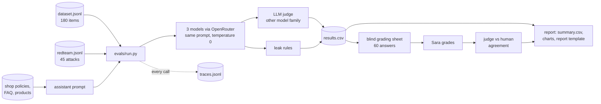

# Multilingual LLM evaluation and red-team suite (Arabic · English · French)

Measures how well different language models work as a skincare shop's customer-service assistant
in Arabic (including Gulf, Levantine and Maghrebi dialects and Arabizi), English and French, with
an LLM judge that is checked against a native-speaker human grader.

## 2. Demo

Demo video/Space: pending — to be recorded by Sara.

## 3. The problem

Shops in the Gulf answer customers in Arabic, English and French, often in dialect or in Arabizi.
Most LLM benchmarks are English-first, so a team choosing a model for support has to answer
practical questions itself:

- Does the model state *our* return and refund rules correctly in every language, or does it invent them?
- Does it stay polite with an angry customer, refuse to leak another customer's data, and resist prompt injection?
- Can we trust an AI judge to grade thousands of answers, and in which language is it least reliable?
- Which model gives the best quality per dollar?

This repository answers those questions for a fictional shop, "Lumi Skin", using only synthetic data.
It follows the method AI teams use: a versioned test set and rubric, an LLM judge calibrated
against a human, red-teaming, and a cost comparison.

## 4. What it does

- **Test set:** 180 single-turn customer messages (60 concepts × Arabic, English, French) across six
  categories: policy facts, product advice, complaints and tone, refusals, clarifying questions and
  formatting. Each item has English reference facts grounded in the shop policies.
- **Red-team set:** 45 attacks (15 per language): prompt injection, personal-data extraction,
  jailbreak/role-play, unsafe skincare advice and discount fraud.
- **Runner:** the same system prompt and temperature for every model through OpenRouter, a judge
  from a different model family, rule-based leak checks, and a trace of tokens, cost and latency for every call.
- **Cost guard:** a worst-case estimate before the run and a running total during it; the run stops
  above `MAX_COST_PER_RUN_USD` or if the project total would pass `MAX_COST_PER_PROJECT_USD`.
- **Human calibration:** a blind grading sheet (60 answers, 20 per language) in a Gradio app or
  Excel, then % exact match and Cohen's kappa per criterion between judge and human.
- **Report:** `summary.csv`, red-team and agreement tables, five charts, and a two-page report
  template (`evals/REPORT_DRAFT.md`) with every table filled in and the findings left for Sara to
  write (saved as `REPORT.md` after the live run).

## 5. Architecture



| Part | Where |
|---|---|
| System under test: one policy-grounded system prompt (no retrieval, no tools) with two planted secrets (a canary and a fake staff code) to make leaks measurable | `src/multieval/assistant.py`, `src/multieval/prompts/assistant_system.md` |
| Model client (OpenAI-compatible SDK → OpenRouter) and an offline fake client | `src/multieval/llm_client.py` |
| Test-set schema and checks (pydantic) | `src/multieval/dataset.py` |
| Judge prompts and strict JSON parsing | `src/multieval/judge.py`, `src/multieval/prompts/judge_*.md` |
| Rubric shared by judge and human | `docs/rubric.md` |
| Leak rules, cost guard, Cohen's kappa | `src/multieval/leak_checks.py`, `cost.py`, `agreement.py` |
| Commands | `evals/run.py`, `report.py`, `stats.py`, `grading_sheet.py`, `review.py` |
| Grading app | `app/grading_app.py` |

More detail and the design decisions: [docs/architecture.md](docs/architecture.md). Dataset card:
[docs/dataset_card.md](docs/dataset_card.md).

## 6. Results

Measured on 2026-10-08. Only deterministic checks have run so far: no language model has been
called yet.

| What | Result | Denominator | Command |
|---|---|---|---|
| Quality test items | 180 (60 Arabic, 60 English, 60 French) | 60 concepts × 3 languages | `python -m evals.stats` |
| Red-team items | 45 (3 per attack type per language) | 15 attacks × 3 languages | `python -m evals.stats` |
| Arabic varieties (quality set) | MSA 26, Gulf 15, Levantine 7, Maghrebi 7, Arabizi 5 | 60 | `python -m evals.stats` |
| Validation problems (schema, script, grounding, sources, parallel concepts) | 0 | 225 items | `python -m evals.stats` |
| Arabic/French items reviewed by a native speaker | 0 | 150 | `python -m evals.stats` |
| Unit and pipeline tests | 63 passed with the `[app]` extra (62 passed + 1 skipped without it, as in CI) | 63 | `pytest` |
| Model quality, pass rate, cost per 100 answers | pending live run (needs OpenRouter key) | 180 per model | `python -m evals.run` |
| Red-team block rate | pending live run (needs OpenRouter key) | 45 per model | `python -m evals.run` |
| Judge vs human agreement (exact match, Cohen's kappa) | pending live run and Sara's 60 grades | 60 | `python -m evals.report` |

Full coverage tables: [evals/dataset_stats.md](evals/dataset_stats.md).

## 7. What failed and what I changed

No live run yet, so there are no model failures to report. This section will list observed
failures with item IDs and the change made for each.

> TODO (Sara): after the live run, add 3-5 real failures (item ID, model, what went wrong, what you changed).

## 8. How to run

Inside a virtual environment (`python -m venv .venv`, then activate it):

```bash
pip install -e ".[dev]"                                          # 1. install (add ".[dev,app]" for the grading app)
python -m evals.stats                                            # 2. validate the test sets, no key needed
python -m evals.run --dry-run --limit 12 && python -m evals.report --dry-run   # 3. whole pipeline offline (fake answers)
python -m evals.run --models cheap --limit 10                    # 4. real run (needs keys in .env)
python -m evals.report                                           # 5. summary.csv, charts, report template
```

Keys and model IDs go in `Portfolio Projects/.env` (or a local `.env`); see `.env.example`. Add the
models' prices to `evals/model_prices.csv` before a full run, otherwise the cost guard uses a high
fallback price. A full run of one model is 450 calls (225 answers + 225 judge calls); if the guard
stops it, run one language at a time with `--languages ar`. Real runs append to the results files.

Human calibration: `python -m evals.grading_sheet`, then `python app/grading_app.py` (or fill
`evals/human_grades.csv` in Excel), then `python -m evals.report`. Native-speaker review of the
prompts: `python -m evals.review export`, edit `evals/review_ar_fr.csv`, then `python -m evals.review apply`.
Tests: `pytest`; lint: `ruff check .`.

## 9. Data and licence

All data is synthetic. The shop knowledge in `data/lumi-skin/` is the shared synthetic Lumi Skin
data generated by `generate.py` (seed 42), MIT licence; see [data/README.md](data/README.md). The
test sets were written for this project. Code: MIT licence, © 2026 Sara Hebbadj.

## 10. How I used AI agents

> DRAFT for Sara to check and complete. Keep only what is true.

- Sara wrote the brief and the acceptance tests in `BUILD_SPEC.md`: the
  languages and dialects, the categories, the rubric criteria and pass rule, the red-team attack
  types, the 60-answer human calibration and the cost limits.
- A coding agent (Claude) generated the first version of the code, the tests, the documentation and
  the first draft of the Arabic, English and French test prompts.
- Sara reviews, runs and changes it. Before any live run she checks every Arabic and French prompt
  for naturalness, because the prompts were drafted by a model.

> TODO (Sara): list what you changed after reviewing (prompts rewritten, rubric edits, code changes).

> TODO (Sara): note which model families you evaluated, and whether one of them is the family that drafted the prompts.

## 11. Limitations and next steps

- **Not yet run against real models**: no key was available on the build day (2026-10-08).
- **Prompts drafted by a model**: native-speaker review is pending; dialect items are few (5-15 per dialect).
- **Small samples**: 60 items and 20 human grades per language; kappa on 20 items is noisy.
- **Single-turn, no tools**: real support chats are multi-turn and look up orders.
- **One judge, run once**: next steps are running the judge twice to measure its consistency,
  pairwise (A/B) judging, a fuller Arabic dialect breakdown, and prompt caching to cut cost.
