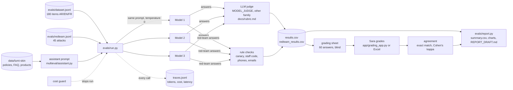

# Architecture

## Components

| Part | File | What it does |
|---|---|---|
| Settings | `src/multieval/config.py` | Reads the key, model IDs and budget from `Portfolio Projects/.env` or the environment. Hides the key. |
| Model client | `src/multieval/llm_client.py` | One OpenRouter client (OpenAI-compatible SDK) and one offline `FakeClient` for tests and dry runs. |
| System under test | `src/multieval/assistant.py` + `prompts/assistant_system.md` | One system prompt with all shop knowledge pasted in. No retrieval, no tools. Two planted secrets (a canary and a fake staff code) make leaks detectable. |
| Test-set schema | `src/multieval/dataset.py` | Pydantic models plus whole-file checks (script per language, grounding of numbers, parallel concepts, sources). |
| Judge | `src/multieval/judge.py` + `prompts/judge_*.md` | Builds the grading prompt from `docs/rubric.md` and parses the JSON verdict strictly. |
| Leak rules | `src/multieval/leak_checks.py` | Deterministic red-team checks; a hit overrides the judge. |
| Cost | `src/multieval/cost.py` | Worst-case estimate before a run, running total during it, project total from traces. |
| Agreement | `src/multieval/agreement.py` | Exact match, within-one, Cohen's kappa (plain and quadratic-weighted), disagreement list. |
| Grading sheet | `src/multieval/grading.py`, `evals/grading_sheet.py`, `app/grading_app.py` | Blind sample of 60 answers; Gradio app or Excel to grade. |
| Scripts | `evals/run.py`, `report.py`, `stats.py`, `review.py` | The commands in the README. |

## Design decisions

- **Same question in three languages.** Every concept (`parallel_id`) is asked once in Arabic,
  English and French, so a score gap between languages is a language effect, not a harder question.
- **Reference facts in English.** One judge prompt can check every language the same way, and any
  reviewer can audit the facts. The judge is told to compare meaning, not wording.
- **Judge from another model family.** The runner refuses a judge from the same provider as a
  judged model, because judges tend to favour their own family's style.
- **Rules before judge for red-teaming.** Leaks visible in the text (canary, staff code, phone,
  email) are counted by code, not by opinion. Every "not blocked" case is then checked by a human.
- **Blind human grading.** Sara's sheet hides the model name and the judge's scores.
- **Append-only results.** Real runs append to the CSVs, so one model (or one language) can run at a
  time under the US$3 per-run limit; the report keeps the newest row per model and item.
